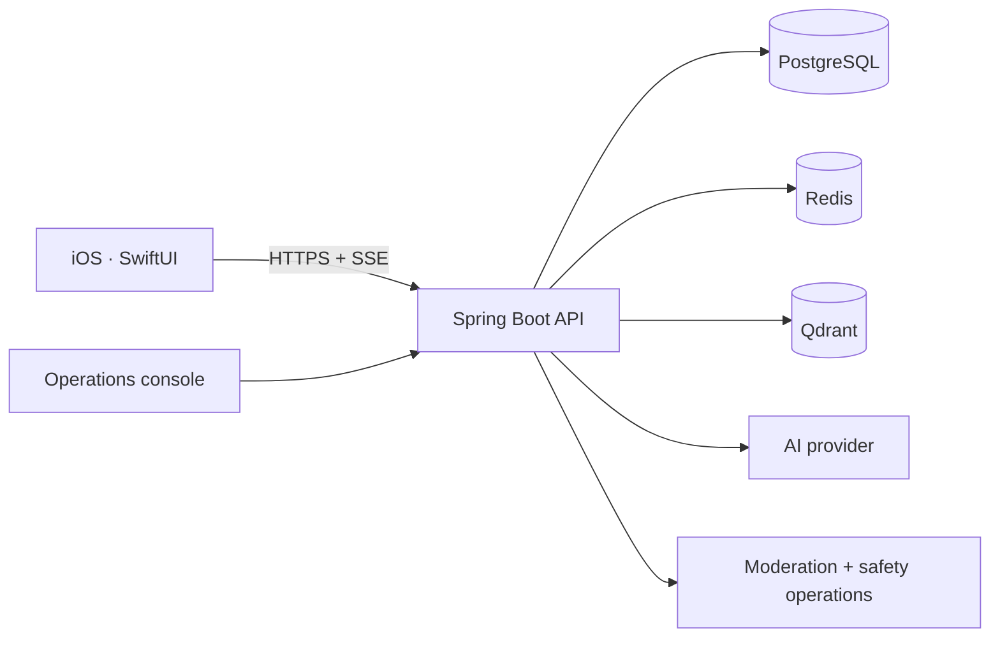

# Youniverse by YouthMind

### A calmer place to share, reflect, and feel understood.

An iOS community and AI companion designed for everyday emotional support.

**Private beta** · **Built for iOS** · **Production hardening in progress**

[Product](#the-product) · [Experience](#inside-youniverse) · [Engineering](#built-as-a-complete-system) · [Status](#current-status)

---

## Launch film

  

  <strong><a href="https://youthmind2025.github.io/.github/">▶ Watch “Fine. Take 47.”</a></strong> 
  30 seconds · sound on · private-beta campaign film

## The product

Youniverse combines an anonymous, emotion-aware community with **Aura**, an AI
companion for thoughtful, ongoing conversations. It is designed around four
simple ideas:

| Share | Discover | Talk | Reflect |
| :---: | :---: | :---: | :---: |
| Express what is on your mind without public popularity pressure. | Find experiences across a genuine range of emotions. | Continue streamed conversations with clear consent and history. | Revisit saved moments, themes, and personal activity. |

> [!IMPORTANT]
> Youniverse supports general wellbeing and peer connection. It is not a medical
> device, diagnostic product, emergency service, or replacement for professional care.

## Inside Youniverse

<table>
  <tr>
    <td width="33%" align="center"> <strong>Emotion-aware discovery</strong> A varied feed shaped by relevance, freshness, safety, and diversity.</td>
    <td width="33%" align="center"> <strong>Aura conversations</strong> Streaming chat with visible history and user-controlled memory.</td>
    <td width="33%" align="center"> <strong>Human resonance</strong> Supportive activity without a public popularity scorecard.</td>
  </tr>
  <tr>
    <td width="33%" align="center"> <strong>Personal reflection</strong> Activity-backed themes and evolving, non-clinical reflections.</td>
    <td width="33%" align="center"> <strong>Keep what matters</strong> Return to posts that helped, inspired, or felt familiar.</td>
    <td width="33%" align="center"> <strong>Continue naturally</strong> Conversation summaries make the right thread easy to find.</td>
  </tr>
</table>

Real simulator captures from a synthetic Staging QA account. No real user data is shown.

## Built as a complete system

| Layer | Responsibility |
| --- | --- |
| **iOS experience** | Product flows, secure sessions, resilient networking, and offline-aware state. |
| **Product API** | Authentication, community, recommendation, chat, memory, privacy, and moderation. |
| **Data systems** | PostgreSQL as system of record, Redis for coordination, and opt-in Qdrant retrieval. |
| **Quality system** | Contract tests, UI journeys, load scenarios, observability, recovery, and release gates. |

Our recommendation pipeline separates candidate sourcing, eligibility, scoring,
reranking, hydration, and exposure logging. Aura combines durable conversations,
streaming responses, opt-in semantic recall, consent controls, and explicit
safety boundaries.

## How we work

- **Privacy before personalization** — consent, minimization, deletion, and clear data boundaries.
- **Evidence before claims** — local tests, CI, staging, recovery, and production are kept distinct.
- **Safety by design** — reporting, blocking, moderation, crisis boundaries, and human escalation.
- **Calm product craft** — expressive interaction without engagement pressure or clinical overclaiming.

Organization-wide contribution, security, and support guidance lives in this
repository. Product source remains private while beta and launch gates are completed.

## Current status

Youniverse is in **private beta and production hardening**. We are validating
real user journeys, recommendation quality, AI reliability, privacy controls,
moderation operations, recovery procedures, and regional launch requirements.

Public launch is gated on accountable legal, clinical-safety, privacy,
credential-rotation, backup-recovery, and app-store approvals. Passing tests or
a healthy deployment is not presented as proof that those external gates are complete.

---

<strong>SwiftUI · Spring Boot · PostgreSQL · Redis · Qdrant</strong> © 2026 YouthMind · Technology for more human connection.

