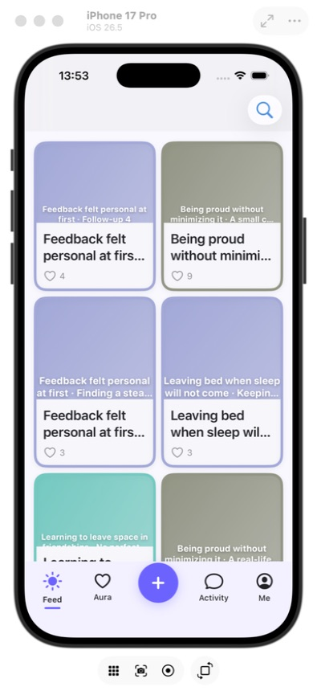
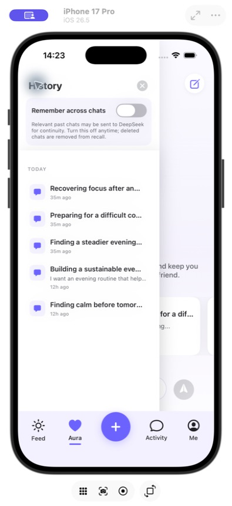
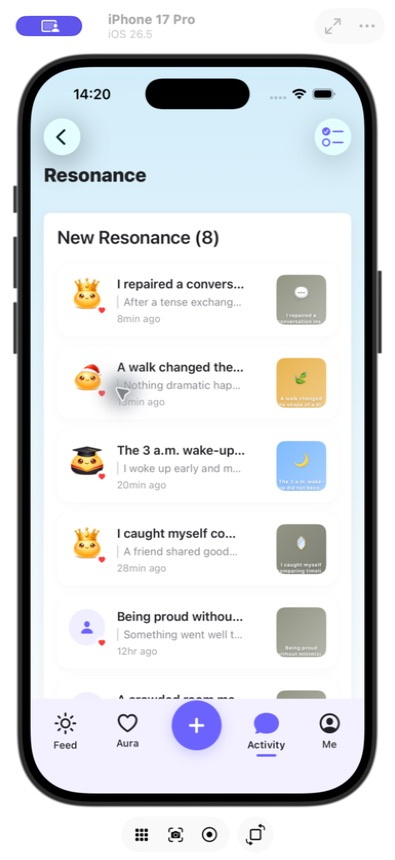
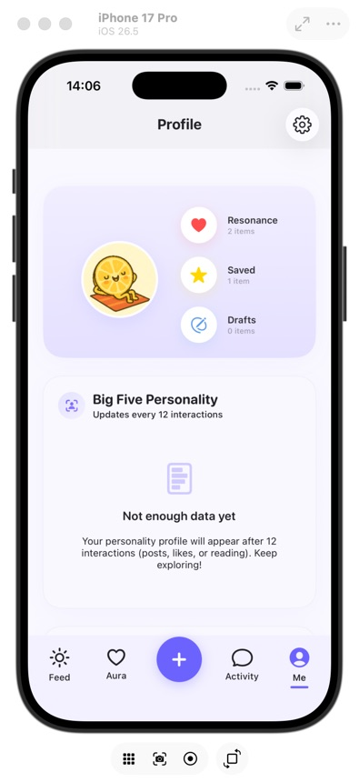
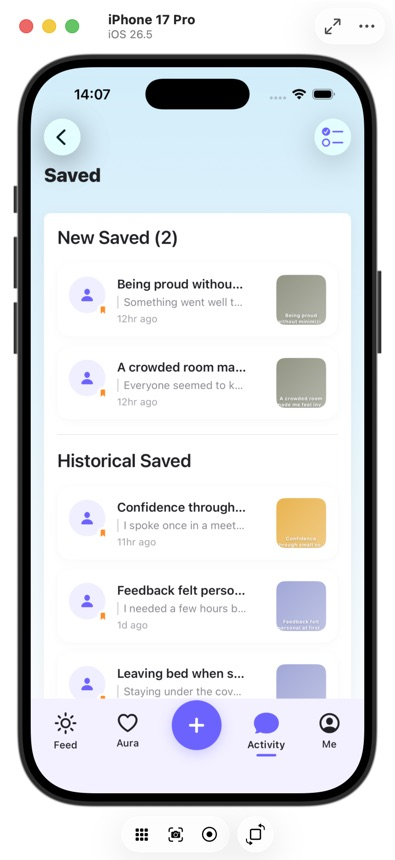
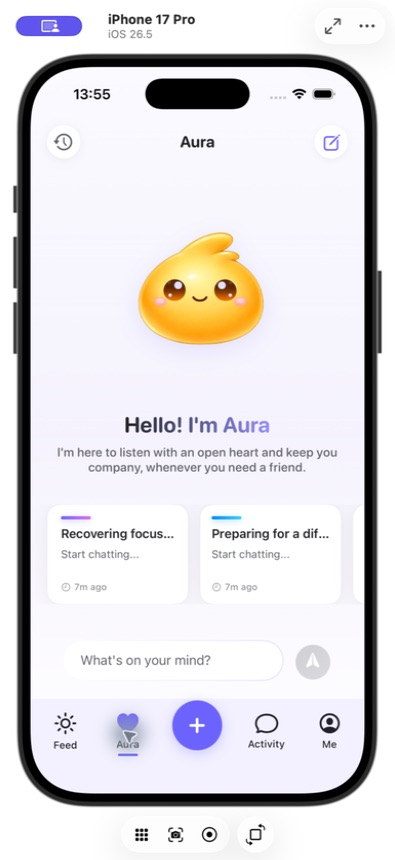

<h1 align="center">Youniverse by YouthMind</h1>

<p align="center">
  <strong>A calmer place to share, reflect, and feel understood.</strong><br>
  An iOS community and AI companion designed for everyday emotional support.
</p>

<p align="center">
  <strong>Private beta</strong> &nbsp;·&nbsp; <strong>Built for iOS</strong>
</p>

## Launch film

<p align="center">
  <strong><a href="assets/youthmind-fine-take-47-30s.mp4">▶ Watch “Fine. Take 47.” — the 30-second Youniverse launch film</a></strong><br>
  <sub>30 seconds · sound on · private-beta campaign film</sub>
</p>

## The product

Youniverse brings together an anonymous, emotion-aware community and **Aura**,
an AI companion built for thoughtful, ongoing conversations. People can share
what is on their mind, discover experiences that resonate, save meaningful
posts, and return to conversations with continuity.

It is designed for general wellbeing and peer connection. It is **not** a
medical device, diagnostic product, or replacement for emergency or
professional care.

## Inside Youniverse

<table>
  <tr>
    <td width="33%" align="center">
      <br>
      <strong>Discover</strong><br>
      <sub>A varied, emotion-aware community feed.</sub>
    </td>
    <td width="33%" align="center">
      <br>
      <strong>Talk with Aura</strong><br>
      <sub>Streaming conversations with clear history and continuity.</sub>
    </td>
    <td width="33%" align="center">
      <br>
      <strong>Feel resonance</strong><br>
      <sub>Supportive interactions without public popularity pressure.</sub>
    </td>
  </tr>
  <tr>
    <td width="33%" align="center">
      <br>
      <strong>Reflect</strong><br>
      <sub>A personal space for saved moments and evolving insights.</sub>
    </td>
    <td width="33%" align="center">
      <br>
      <strong>Keep what matters</strong><br>
      <sub>Return to posts that helped, inspired, or felt familiar.</sub>
    </td>
    <td width="33%" align="center">
      <br>
      <strong>Continue naturally</strong><br>
      <sub>Return to recent conversations or begin somewhere new.</sub>
    </td>
  </tr>
</table>

<p align="center"><sub>Captured from a synthetic Staging QA account. No real user data is shown.</sub></p>

## What we are building

| Experience | Purpose |
| --- | --- |
| **Anonymous community** | Share honestly and discover experiences across a range of emotions. |
| **Aura AI companion** | Receive responsive, streamed conversation with opt-in cross-chat memory. |
| **Personal reflection** | Revisit saved posts, conversations, emotional themes, and interaction history. |
| **Responsible recommendations** | Combine relevance, diversity, freshness, safety, and explicit negative feedback. |
| **Safety operations** | Support reporting, blocking, moderation queues, crisis boundaries, and human escalation. |

## Built as a complete system

```text
iOS / SwiftUI
      │ HTTPS + streaming
Spring Boot API
      ├── PostgreSQL · durable product data
      ├── Redis      · caching and coordination
      ├── Qdrant     · opt-in semantic retrieval
      ├── AI service · Aura responses and analysis
      └── Admin      · moderation and operations
```

The platform includes the iOS experience, authenticated APIs, recommendation
pipeline, durable conversations, semantic memory, moderation tooling,
observability, infrastructure definitions, and reproducible test suites.

## Current status

Youniverse is in **private beta and production-hardening**. We are validating
real user journeys, recommendation quality, AI reliability, privacy controls,
moderation operations, recovery procedures, and regional launch requirements
before describing it as publicly production-ready.

<p align="center">
  <strong>SwiftUI · Spring Boot · PostgreSQL · Redis · Qdrant</strong>
</p>

<p align="center">
  <sub>© 2026 YouthMind · Technology for more human connection.</sub>
</p>
